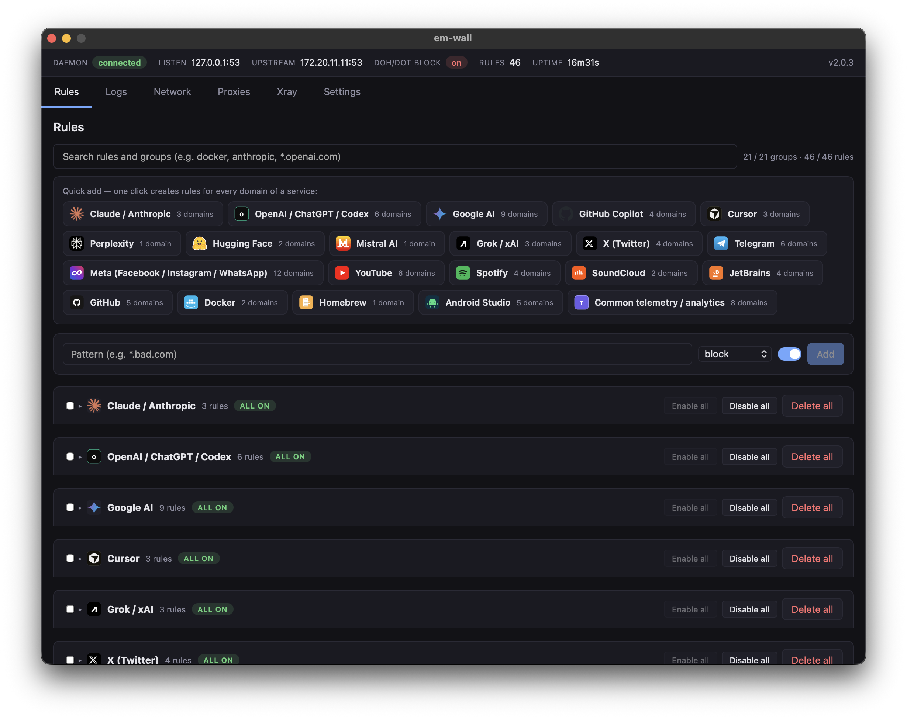

# em-wall



A macOS firewall that works at the DNS layer. Every domain lookup on your machine passes through em-wall before any connection is made — rules decide whether it is blocked, allowed, or routed through a specific network interface, VPN app, SOCKS/HTTP proxy, or embedded Xray outbound.

- Block domains and wildcards (`*.example.com` matches the apex and all subdomains).
- Route specific domains out a chosen target: a raw interface (`utun3`), a running VPN app by key (`app:tailscale`), a configured upstream proxy (`proxy:work`), or an embedded Xray outbound (`xray:home`).
- Curated domain groups (OpenAI, Anthropic, Google, Meta, X, Telegram, JetBrains, …) for one-click bulk rules, plus bulk enable/disable/delete on whole groups.
- Optional toggle to block encrypted DNS (DoH/DoT), which would otherwise bypass the firewall entirely.
- Live log of every DNS query with the decision that was applied.
- Embedded [xray-core](https://github.com/XTLS/Xray-core): manage outbounds, import VLESS/VMess/Trojan links, edit raw JSON in a Monaco editor, per-entry latency test, capped rolling log.

## How it works

Two binaries talk over a Unix socket:

```
em-wall.app  (Wails + Vue, user-space)
     │
     │  /var/run/em-wall.sock  (newline-framed JSON-RPC)
     │
em-walld  (LaunchDaemon, root)
  ├─ core/rules      GORM + SQLite rule store
  ├─ core/decision   rule engine, in-memory cache
  ├─ core/dnsproxy   UDP + TCP server on 127.0.0.1:53
  ├─ core/routing    per-host route installer via /sbin/route
  ├─ core/applocator app-key → currently-owned utun lookup (lsof)
  ├─ core/proxy      SOCKS/HTTP upstream proxies (proxy:NAME target)
  ├─ core/proxytun   userspace TUN that funnels matched traffic into a proxy
  ├─ core/xray       embedded xray-core lifecycle + config builder
  └─ core/pfctl      pf anchor for DoH/DoT blocking
```

The daemon owns everything — the UI is a thin client that forwards calls over IPC. On each DNS query the engine finds the most-specific matching rule (exact beats wildcard at the same depth) and dispatches:

- **block** → NXDOMAIN with a negative-cache TTL.
- **allow** with no interface → forward upstream as normal.
- **allow/route** with `Interface = "utunN"` → forward, then install `route -host <ip> -interface utunN` for every A/AAAA in the answer.
- **route** with `Interface = "app:KEY[,KEY...]"` → resolve the app key to its current utun via `applocator` (first running wins) and pin routes there; an app watcher flushes and re-installs on utun changes so restarting the VPN doesn't strand traffic.
- **route** with `Interface = "proxy:NAME"` or `"xray:NAME"` → install routes that point at em-wall's userspace TUN, which forwards matched flows into the configured SOCKS/HTTP proxy or Xray outbound.

## Repo layout

```
core/          Go library — fully testable without root
  rules/       SQLite store + wildcard matcher
  decision/    rule evaluation engine
  dnsproxy/    DNS server + multi-upstream forwarder
  routing/     per-host route installer
  applocator/  app-key → currently-owned utun resolver
  proxy/       SOCKS/HTTP upstream proxy registry
  proxytun/    userspace TUN that funnels matched flows into a proxy
  xray/        embedded xray-core lifecycle + JSON config builder
  pfctl/       pf anchor manager
  ipc/         Unix-socket JSON-RPC (protocol.go is the wire contract)
  groups/      curated domain group definitions
  version/     build-time version stamp

daemon/        em-walld — wires core/* together, runs as LaunchDaemon
app/           Wails + Vue 3 UI (separate Go module via go.work)
  app.go       thin IPC client; every method forwards one RPC call
  internal/installer/  in-app install / uninstall logic
  frontend/    Vite + Vue 3 + TypeScript (Rules / Logs / Network / Proxies / Xray / Settings)

assets/        source assets (app icon, screenshots)
launchd/       LaunchDaemon plist template
```

## Develop

**Required:** Go 1.21+, Node 18+, [Wails v2](https://wails.io) at `~/go/bin/wails`.

```bash
make test            # core unit tests — no root, no port 53 needed
make run-daemon      # local daemon on :5353 with ./tmp/dev.db (no root)
make run-app         # wails dev UI — run in a second terminal
```

`make run-daemon` starts em-walld against a local DB and socket so the UI can connect without touching system DNS. The install panel will show `not packaged` — that is expected in dev; the rule/log/network tabs work normally.

### Adding a feature

The IPC protocol is the single source of truth. Adding a method:

1. Define the DTO and method constant in [core/ipc/protocol.go](core/ipc/protocol.go).
2. Register the handler in `daemon/main.go` → `registerHandlers`.
3. Expose a method on `app/app.go` that calls `a.call(ipc.MethodXxx, ...)`.
4. Run `wails generate module` inside `app/` to regenerate the TypeScript bindings.

### Build a distributable app

```bash
make app-bundle      # builds app/build/bin/em-wall.app (fully self-contained)
```

The Makefile always rebuilds the daemon from source before bundling so the embedded binary is never stale.

## Install

Open `em-wall.app`. On first launch an **Install** screen appears — clicking it triggers the standard macOS admin prompt and writes the daemon, LaunchDaemon plist, and pf anchor to their system paths. After install, activate the DNS hijack from the **Settings** tab.

## Uninstall

**Settings → Uninstall em-wall** inside the running app. The flow deactivates the DNS hijack first (restoring your original per-service DNS from its saved backup), removes the daemon and all system files, and runs a safety sweep to ensure no network service is left pointing at `127.0.0.1`.
